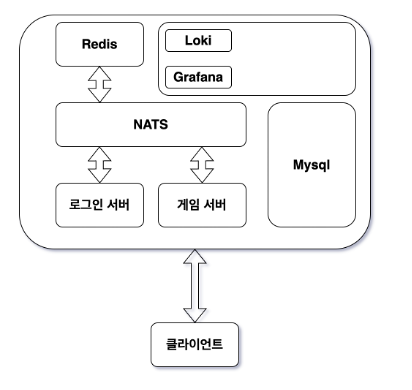

# Clicker Game
화면을 클릭하여 게임내 재화를 벌고 성장하는 게임입니다. 

### Architecture


### Build
```bash
git clone https://github.com/txuna/clicker-game.git
cd clicker-game/server
make kind-create

make push-login stage=local
make push-game stage=local
make push-redis-client stage=local

make deploy-base-all
make deploy-app-all

# init mysql
mysql -h 127.0.0.1 -P 3307 -u root -p1234qwer! clicker-game < clicker-game.sql

# port-forward
kubectl port-forward svc/mysql -n mysql 3307:3306
kubectl port-forward svc/login -n login 9001:9001
kubectl port-forward svc/game -n game 9003:9003
```

### TEST
```bash
cd clicker-game/client/test_client
go build
./client
```

### DEMO


### Cleanup 
```bash
make remove-app-all
make remove-base-all
```